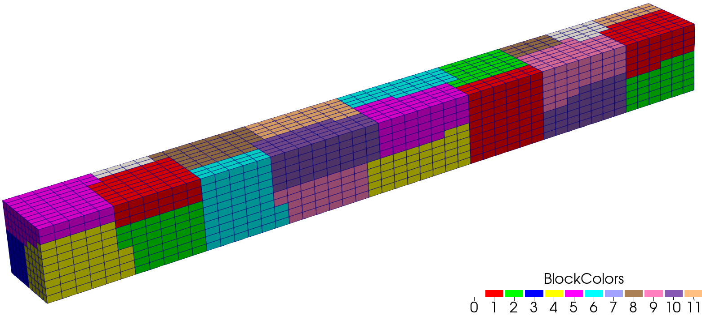

    

# Overview
ASAUM - *Adaptive Structured and Unstructured Mesh* - is a C++ library for representing distributed, multi-block structed and unstructured meshes.
The library is meant to provide users with the ability to read/write, partition, and query the large
distributed meshes that are commonly used in scientific computing.

# Getting started
First, install dependiencies in Ubuntu 24.04

    sudo apt install cmake liblua5.4-dev libexodusii-dev libparmetis-dev mpich libmpich-dev

Build the code with cmake

    mkdir build
    cd build
    cmake <PATH_TO_SOURCE>
    make
